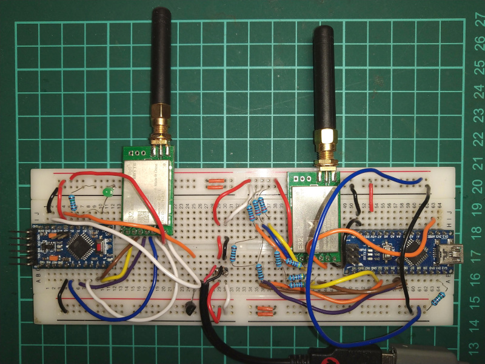
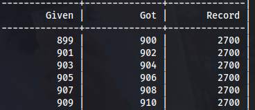
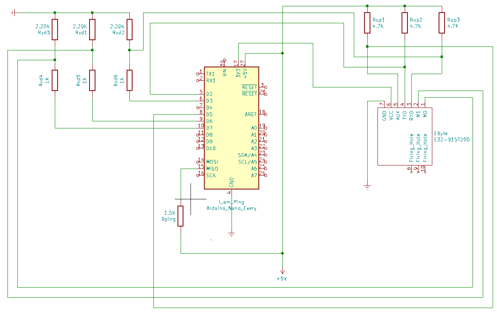
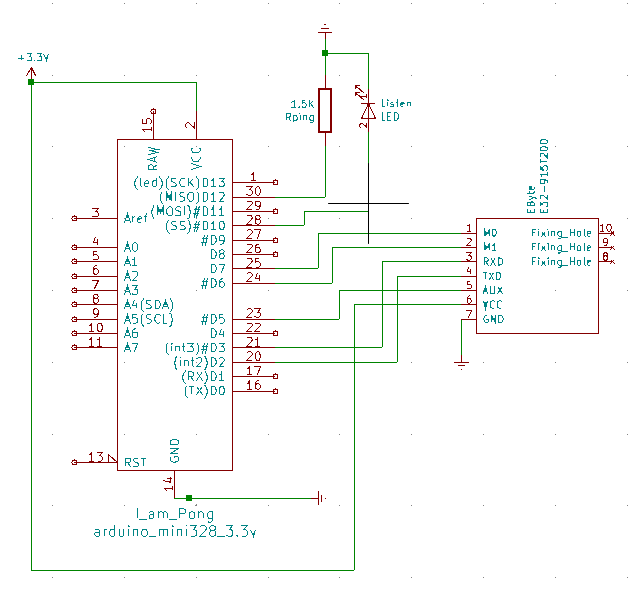

CommoTalkino
============

This project is an implementation example of CommoTalkie SDK. 
See [https://github.com/westial/commotalkie](https://github.com/westial/commotalkie)

The proof of concept consists on sending and getting back a message from the node A and the node B.
To use a more familiar context lets imagine a ping pong match. The node A is Ping,
and the node B is Pong.



_Attention: There is a Linear Voltage Regulator between the 5V and the Arduino Pro
Mini 3.3V._

* [Ping pong](#ping-pong)
* [Circuits](#circuits)
  + [Arduino Nano as Ping](#arduino-nano-as-ping)
  + [Arduino Pro Mini 3.3V as Pong](#arduino-pro-mini-33v-as-pong)
* [Install](#install)
  + [Deploy CommoTalkie into this project](#deploy-commotalkie-into-this-project)
* [License](#license)
* [Author](#author)

## Ping pong ##

The ball of this particular game is a number, the total number of hits between
Ping and Pong.

Ping always shots the first, the hit values 1. Pong gets the ball, adds one to 
the hit value, so now hit values 2, and returns the ball to Ping. Ping, again
adds 1 to hit and returns the ball to Pong as 3, and so on.

If the communication is broken for any reason, the hit value resets to 0.

The printed output of the program is a table with 3 columns:

* Given: the last given value.
* Got: the last got value.
* Record: the highest value of hit since the beginning, no matters the times it 
  could have been reset to 0.



After trying out dozens of times my circuit. I got a mean of 1800-2000 hits 
before a timeout breaks the count. It's like a 0.1% error margin. And all errors
are `Timeout` like errors, so the problem is that when a node responds the other
one is not listening yet. Probably adjusting some delays the result could be 
improved.

## Circuits ##

Kicad project here [doc/commotalkino_pingpong/commotalkino_pingpong.pro](doc/commotalkino_pingpong/commotalkino_pingpong.pro).

I tried with two different Arduino MCU, Nano at 5V and Pro Mini at 3.3V.

In the following schemes Nano is Ping and Pro Mini is Pong because there is a
pin listening to. The pin D12 of both MCU is reading HIGH for Ping or else LOW
for Pong. It is totally safe to reverse it and play the opposite role.

### Arduino Nano as Ping ###

The following schema is the circuit for Nano, in this case, Ping.



### Arduino Pro Mini 3.3V as Pong ###

The following schema is the circuit for Pro Mini, in this case, Pong.



## Install ##

This project is not developed on Arduino IDE but in [PlatformIO](https://platformio.org/).
The main building configuration file, [platformio.ini](platformio.ini) provides
the serial interface to both Arduino devices in a different port, /dev/ttyUSB0
and /dev/ttyUSB1. Probably you may change this configuration.

### Deploy CommoTalkie into this project ###

The main dependency of this project is [CommoTalkie](https://github.com/westial/commotalkie)
and I decided to import from local. So it has to be downloaded first.

Luckily [Makefile](Makefile) gets this job done. It downloads the SDK and installs 
into the required directory. Launch the following command to deploy the SDK.

```shell
make deploy
```

If you have already installed the SDK but, it gets upgraded and you want the 
new version, update CommoTalkie SDK by the following command.

```shell
make update
```

Cleaning feature is provided as well.

```shell
make clean
```

## License ##

GNU General Public License (GPLv3). Read the attached [license file](LICENSE.txt).

## Author ##

Jaume Mila Bea <jaume@westial.com>
